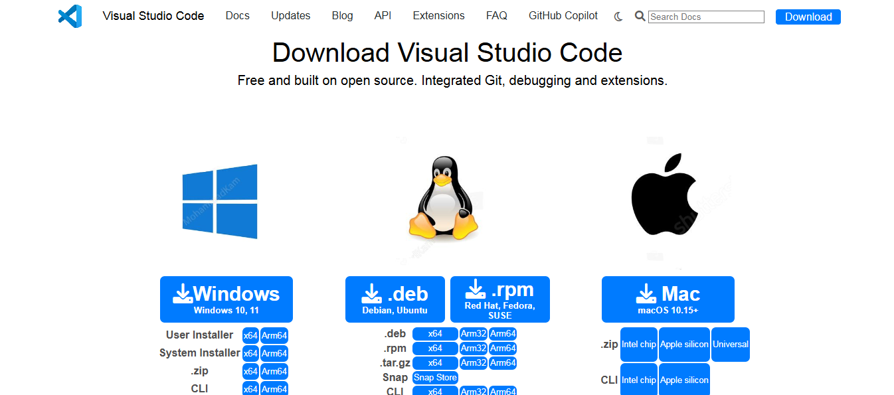

# 💻 VSCode Page Clone

This is a **Visual Studio Code web interface clone**, built with the intention to replicate the look and feel of VSCode using modern frontend technologies.

🚀 **Live Demo**: [Click to Visit](https://sadik-vscode.netlify.app/)

---

## 🧾 Features

- 🎨 Clean, pixel-perfect UI inspired by Visual Studio Code
- 🌙 Dark mode design for authentic experience
- ⚙️ Sidebar with icons resembling VSCode's file explorer and settings
- 📁 File tabs and layout similar to the original
- 💡 Great for practicing HTML/CSS/JS layouting skills

---

## 🛠️ Technologies Used

- **HTML5**
- **CSS3**
- **JavaScript**
- **Netlify** for deployment

---

## 📸 Screenshots

| Home Page |
|-----------|
|  |
